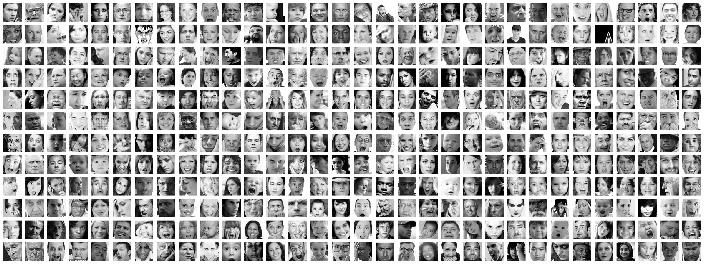
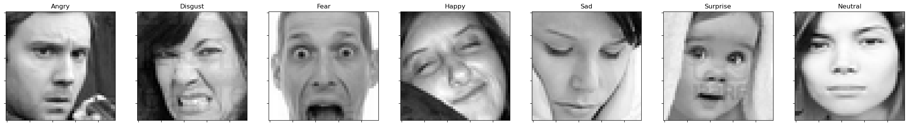
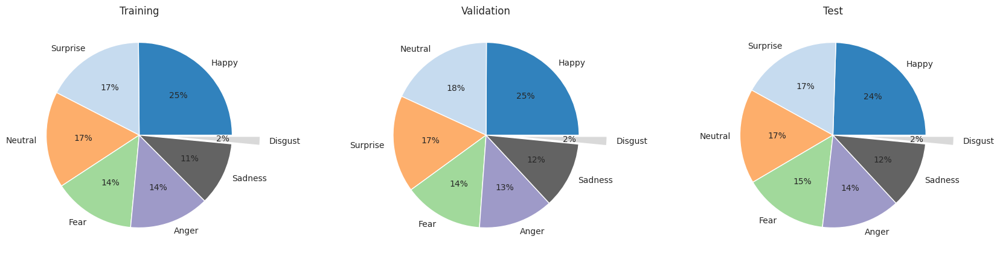

# Facial emotion recognition: A prediction web service



## Table of Contents
- [Project Overview](#project-overview)
- [Getting started immediately](#getting-started)
- [Datasets](#datasets)
- [Model](#model)
- [Dependencies](#dependencies)
- [Workflow](#workflow)
- [Directory structure](#dirctory-structure)
- [Follow-up Work](#follow-up-work)
- [Contributors](#contributors)
- [License](#license)
- [Acknowledgments](#acknowledgments)
- [Contributions and Feedback](#contributions-and-feedback)
- [Key Concepts](#key-concepts)

---

## [Project Overview](#project-overview)

Understanding human emotions is crucial for human-computer interaction, artificial intelligence, and affective computing. Whether applied in virtual assistants, sentiment analysis, or interactive systems, accurate facial emotion recognition enhances user experience and engagement. This project delves into the realm of facial emotion recognition:
* using the Kaggle Facial [Expression Recognition Challenge](https://www.kaggle.com/c/challenges-in-representation-learning-facial-expression-recognition-challenge/data) dataset
* building a [Convolutional Neural Network (CNN) Tensorflow/Keras model](./models/emotion_classifier.h5), and
* deploying it as an Amazon web service using ECR, Lambda and a [REST API gateway](./scripts/test-aws-rest-api.py).

As emotions play a pivotal role in communication, this project aims to contribute to the evolving landscape of emotion-aware technology. It was done as part of the two-week end-of-course capstone project for the [Machine Learning Zoomcamp](https://github.com/DataTalksClub/machine-learning-zoomcamp). With a dataset of low-resolution (48x48 pixel) images and limited hardware, we achieved a 65% accuracy in classifying emotions, with particularly positive results on the emotions 'happy', 'anger' and 'sad'. We hope to keep working on this project and improving it. Dive into the repository to explore the code, [contribute to advancements](#contributions-and-feedback), and potentially integrate the model into your projects for a more emotionally intelligent interface.

## [Getting started immediately](#getting-started)

Pull up any image of a facial expression from the internet, and use [this script](./scripts/test-aws-rest-api.py) to make a prediction. For example:

```bash
(base) $~> python scripts/test-aws-rest-api.py 
{'Anger': 0.0, 'Disgust': 0.0, 'Fear': 0.0, 'Happy': 1.0, 'Neutral': 0.0, 'Sadness': 0.0, 'Surprise': 0.0}
```


## [Datasets](#datasets)

The FER2013 dataset, curated by Pierre-Luc Carrier and Aaron Courville, was developed for the Kaggle competition titled [Challenges in Representation Learning: Facial Expression Recognition Challenge](https://www.kaggle.com/c/challenges-in-representation-learning-facial-expression-recognition-challenge). All the dataset files can be downloaded and decompressed from [here](https://www.kaggle.com/c/challenges-in-representation-learning-facial-expression-recognition-challenge/data). This dataset provides a valuable resource for exploring challenges in representation learning and advancing facial expression recognition algorithms. There are more details about the dataset [**here**](./data/README.md).




## [Model](#model)

The facial emotion recognition model is a **Convolutional Neural Network (CNN)** tailored for image classification, particularly designed to discern human emotions from facial expressions. Trained on the Kaggle Facial Expression Recognition Challenge dataset, the model exhibits a robust architecture comprising convolutional and fully connected layers. It employs a series of convolutional layers, each followed by Batch Normalization, ReLU activation, MaxPooling, and Dropout, culminating in a softmax-activated output layer for multiclass classification of seven emotions. 
To enhance performance and mitigate overfitting, the model integrates data augmentation techniques, including random horizontal flipping and contrast adjustments. 

The resulting model is saved in HDF5 format as **'models/emotion_classifier.h5'** for later deployment. Furthermore, the model is converted to TensorFlow Lite format **('models/emotion_classifier.tflite')** to enable its deployment in resource-constrained environments, ensuring its versatility and accessibility across various platforms. The model currently has an accuracy of 65% and works particularly well on 'happy', 'anger' and 'sad' emotions. However, with more work, it's performance can be made much better.

## [Workflow](#workflow)

### 1. Cloning the repository: 

```bash
git clone git@github.com:abhirup-ghosh/facial-expression-classifier-app.git
```

### 2. **Setting up the environment:**

The easiest way to set up the environment is to use [Anaconda](https://www.anaconda.com/download). I used the standard Machine Learning Zoomcamp conda environment `ml-zoomcamp`, which you can create, activate, and install the relevant libraries in, using the following commands in your terminal:

```bash
conda create -n ml-zoomcamp python=3.9 -y
conda activate ml-zoomcamp
conda install numpy pandas scikit-learn seaborn jupyter tensorflow -y

# install tflite-runtime
pip install --extra-index-url https://google-coral.github.io/py-repo/ tflite_runtime
```

Alternatively, I have also provided a conda `environment.yml` file that can be directly used to create the environment:

```bash
conda env create -f opt/environment.yml
```

### 3. Running `notebooks/notebook.ipynb`

You can run the notebook on **[Google Colab](https://colab.research.google.com/github/abhirup-ghosh/facial-expression-classifier-app/blob/main/notebooks/notebook.ipynb)**. Details of the instance are:
* Notebook: Python3 
* Hardware: Single T4 GPU

```
Package     : Verion
--------------------
pandas      : 1.5.3
numpy       : 1.23.5
matplotlib  : 3.7.1
seaborn     : 0.12.2
sklearn     : 1.2.2
pickle      : 4.0
tensorflow  : 2.14.0
```


This notebook outlines the entire investigation and consists of the following steps [🚨 Skip this step, if you want to directly want to use the final configuration for training and/or final model for predictions]:

- Data Loading: `data/icml_face_data.csv`  
- Data preprocessing
- Exploratory data analysis
- Setting up a validation framwork
- Model definition: CNN (+ data augmentation)
- Model evaluation [and hyper-parameter tuning]
- Saving the best model: `models/emotion_classifier.h5`
- Preparation of the test data
- Making predictions using the saved model
- Convert to TF-Lite model: `models/emotion_classifier.tflite`
- Remove TF dependency

### 4. **Training model**
We encode our best, tuned CNN model inside the scripts/train.py file which can be run using:

```bash
cd scripts
python train.py
```
The output of this script can be found in: `models/*`. It has an average accuracy of 65% and will be used for the following steps. The training script also converts the keras model into a light-weight TF-lite model.

### 5. **Prepare Code for Lambda**

#### 5.1. Running `notebooks/notebook-lambda.ipynb`

This notebook provides a step-by-step guide for preparing the Lambda Code:
* Use `tflite_runtime` model instead of Keras model
* Remove any tensorflow/keras dependency on preprocessing/prediction
* Define `predict(url)` function to make prediction on an **image url (input)**; output is a dictionary of emotion classes with respective probabilities.
* Create  `lambda_handler(event, context)` wrapper for calling `predict(url)`

#### 5.2. `scripts/lambda_function.py`

Once we test out the entire lambda framework using the above notebook, we convert it into a python script.

### 6. Make predictions

**Test Event: Happy**

```
event = {'url': 'https://upload.wikimedia.org/wikipedia/commons/0/09/The_joy_of_the_happy_face_by_Rasheedhrasheed.jpg'}
```


**Prediction: Happy**
```bash
facial-expression-classifier-app/scripts> python

Python 3.9.18 (main, Sep 11 2023, 08:20:50) 
[Clang 14.0.6 ] :: Anaconda, Inc. on darwin
Type "help", "copyright", "credits" or "license" for more information.

>>> import lambda_function

>>> event = {'url': 'https://upload.wikimedia.org/wikipedia/commons/0/09/The_joy_of_the_happy_face_by_Rasheedhrasheed.jpg'}

>>> lambda_function.lambda_handler(event, None)

{'Anger': 8.256378446588042e-35, 'Disgust': 2.9382650407717056e-39, 'Fear': 2.9382650407717056e-39, 'Happy': 1.0, 'Neutral': 0.0, 'Sadness': 0.0, 'Surprise': 0.0}
```


### 7. Containerization: Docker

Run the `Dockerfile` using [make sure that the docker daemon is running] to build the image `facial-emotion-recognition`:

```bash
docker build -t facial-emotion-recognition .
```
Add the option `--platform linux/amd64` if working on amd64 architecture, as I was, to identify the appropriate wheel for for TF-Lite (Tensorflow 2.14.0). Once the image is built, we need to expose the container port (8080) to the localhost port (8080) using:

```bash
docker run -it --rm -p 8080:8080 --platform linux/amd64 facial-emotion-recognition:latest
```
We can now make a request using our test script `scripts/test.py`:

```
python test.py
# {'Anger': 8.252851389563724e-35, 'Disgust': 0.0, 'Fear': 0.0, 'Happy': 1.0, 'Neutral': 0.0, 'Sadness': 0.0, 'Surprise': 0.0}
```

### 8. **Deploying as an Amazon Web Service (using ECR/Lambda/REST API Gateway)**

Please follow the instructions detailed [here](./docs/deployment-AWS-instructions.md) to:

- build, tag and run docker container image
- create AWS elastic container registry (ECR) repository: **facial-emotion-recognition**
- publish docker container image to ECR repository as tagged image: **facial-emotion-recognition-001**
- create, configure and test AWS Lambda function
- create, configure and test AWS Rest API Gateway to access Lambda function
- make prediction using POST METHOD `/predict`

Invoke URL: https://xowsdry1bc.execute-api.eu-north-1.amazonaws.com/Test/predict

```bash
(base) $~> python scripts/test-aws-rest-api.py 
{'Anger': 0.0, 'Disgust': 0.0, 'Fear': 0.0, 'Happy': 1.0, 'Neutral': 0.0, 'Sadness': 0.0, 'Surprise': 0.0}
```

## [Directory structure](#dirctory-structure)

```bash
facial-expression-classifier-app/
├── Dockerfile
├── LICENSE
├── README.md
├── data
│   ├── README.md
│   └── challenges-in-representation...
│       ├── example_submission.csv
│       ├── fer2013
│       │   ├── README
│       │   ├── fer2013.bib
│       │   └── fer2013.csv
│       ├── icml_face_data.csv
│       ├── test.csv
│       └── train.csv
├── docs
│   ├── deployment-AWS-instructions.md
├── media
│   ├── banner.png
│   ├── class_counts.png
│   ├── emotions.png
│   └── test_image_happy.jpeg
├── models
│   ├── emotion_classifier.h5
│   └── emotion_classifier.tflite
├── notebooks
│   ├── notebook-lambda.ipynb
│   └── notebook.ipynb
├── opt
│   └── environment.yml
└── scripts
    ├── lambda_function.py
    ├── test-aws-rest-api.py
    ├── test.py
    ├── test_image_anger.jpg
    └── train.py

11 directories, 28 files
```

## [Follow-up Work](#follow-up-work)

**Improvement of CNN model:** currently has an accuracy of 65% and works particularly well on 'happy', 'anger' and 'sad' emotions. However, it's overall performance and it's performance on other emotions can be improved with more work.

**Dataset:** extend to RGB images of higher resolution.

## [Contributors](#contributors)
Abhirup Ghosh, <abhirup.ghosh.184098@gmail.com>

## [License](#license)
This project is licensed under the [MIT License](./LICENSE).

## [Acknowledgments](#acknowledgments)
* [Alexey Grigorev](https://github.com/alexeygrigorev)
* [DataTalks.Club](https://datatalks.club/)
*  Pierre-Luc Carrier, Aaron Courville [[data citation]](data/challenges-in-representation-learning-facial-expression-recognition-challenge/fer2013/fer2013.bib)

## [Contributions and Feedback](#contributions-and-feedback)

Your contributions and feedback are highly valuable to enhance the quality and functionality of this Facial Emotion Recognition (FER) Predictor project. Whether you identify a bug, suggest an improvement, or contribute code, your involvement is crucial for the project's success.

### How to Contribute

1. **Issues and Bug Reports:** If you encounter any issues or bugs, please [create an issue](https://github.com/abhirup-ghosh/facial-expression-classifier-app/issues). Include detailed information about the problem, steps to reproduce it, and any relevant screenshots.

2. **Feature Requests:** If you have ideas for new features or enhancements, feel free to [submit a feature request](https://github.com/abhirup-ghosh/facial-expression-classifier-app/issues/new) on GitHub. Clearly outline the proposed feature and its potential benefits.

3. **Code Contributions:** If you are interested in contributing code, you can [fork the repository](https://github.com/abhirup-ghosh/facial-expression-classifier-app/fork) and submit pull requests with your changes. Ensure that your code follows the project's coding standards and practices.

4. **Documentation Improvements:** Clear and comprehensive documentation is essential. If you find areas where the documentation can be improved, please let us know or directly submit a pull request to enhance it.

### Feedback

Your feedback is crucial for the continuous improvement of this project. If you have any suggestions, comments, or positive experiences related to the FER Predictor, please share them. Your insights can help shape the future development of this project and make it more effective for users. Thank you for your contributions and feedback, as they play a vital role in making this project better for everyone involved.

## [Key Concepts](#key-concepts)

* Computer Vision
* Data augmentation
* Keras/Tensorflow/Tensorflow-Lite
* Convolutional Neural Networks
* Docker
* AWS Lambda
* AWS ECR
* AWS API Gateway
* REST API
* Web Service